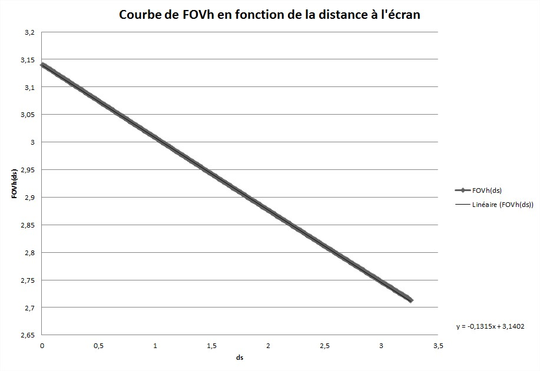

#TP Limites de perception visuelle

##Application de test

```
1. Elle est capable d’afficher l’image gauche seule, l’image droite seule ou deux images en
stéréo via le mode Quad Buffer d’OpenGL. Pour cela elle fera appel une ou deux fois à
une fonction d’affichage en fonction de paramètres dx et dy représentant la parallaxe,
c’est-à-dire le décalage entre les objets sur les deux images. Il faudra penser à ajoutet
GLUT_DOUBLE et GLUT_STEREO dans le display mode.
2. Cette fonction d’affichage devra être capable d’afficher plusieurs types d’objet selon le
paramétrage de l’application : un point (représenté sous la forme d’un disque plein),
une ligne verticale, une ligne horizontale ou une image
3. Les interactions possibles seront les suivantes :
— augmenter et diminuer la parallaxe horizontale (le pas devra être réglable)
— augmenter et diminuer la parallaxe verticale (le pas devra être réglable)
— changer l’objet affiché
— quitter l’application
```

##EXPÉRIENCES DE PERCEPTION VISUELLE

###MESURES ET CALCULS PRÉLIMINAIRES

1. La distance ds entre vos yeux et l’écran

```dyeux = 69 cm```

2. Calculer votre champ visuel horizontal FOVh par rapport à l’écran
```
écran
|
|
|<---------------------- (yeux)
|
|
|
```

Donc l'angle est de:
```FOVh = 2*arctan(L(écran)/(2*dyeux)) = 0.82 rad = 47 degrés```

3. Calculer la taille s d’un pixel à l’écran en minutes d’angle
Il y a 1920 pixels sur une ligne horisontale de l'écran. 
```s = (47/1920)*60 = 1.47 minutes d'angle.```

4.Tracez les courbes *FOVh(ds)* et *s(ds)* en faisant bien apparaître *ds*



Ce qui m'étonne avec cette courbe, c'est qu'elle est croissante, alors que j'aurais tendance à penser que quand la distande à l'écran augmente, l'angle de vue diminue, non? 

###PARALLAXE

Établissez les équations qui relient la parallaxe à l’écran (dx et dy ) à la disparité rétinienne
exprimée sous forme angulaire.


####Mesures

1. la disparité rétinienne maximale que vous pouvez supporter en continu, c’est-à-dire
en partant de dx = 0 et en augmentant progressivement sa valeur

2. la disparité rétinienne maximale que vous pouvez supporter en fermant les yeux quelques
secondes et les rouvrant sur l’écran

3. les mêmes mesures pour la parallaxe verticale

